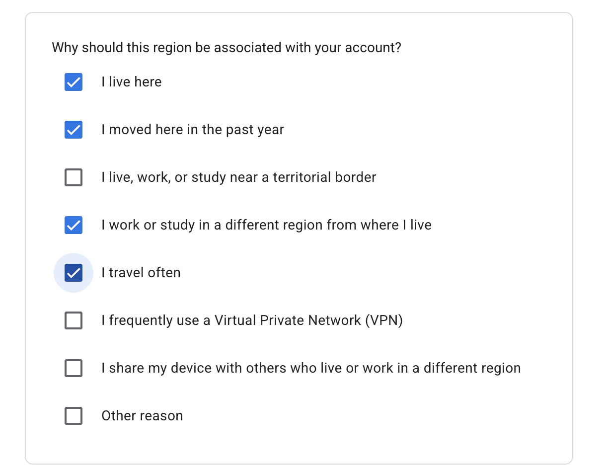

# 彻底解决！Google Antigravity 提示“Your current account is not eligible”完美指南

## 1. 踩坑背景：为什么切了代理还是报错？

随着 Google Antigravity 的持续火热（注：2026 年 7 月 10 日后，Google 已调整了免费支持政策），不少 AI 开发者在尝试登录和体验时，都遭遇了下面这个让人头疼的报错：

> **`Your current account is not eligible for Antigravity`**

很多人遇到这个问题时的**第一反应**是：

- 疯狂切换 VPN / 节点（美国、日本、新加坡轮番试）
- 清理浏览器缓存 / 开无痕模式
- 甚至在 GitHub 上搜索挂载各种脚本/工具（如 `Antigravity-Manager` 等）

**但结果通常依然是：打不开！**

原因其实很简单：**这并不是单纯的当前 IP 限制，而是 Google 账号本身的“归属地（Country/Region）”被锁定在了不支持的区域。**

---

## 2. 原理解析与排查步骤

Google 会根据你注册账号时的网络环境、支付信息等，为你的账号关联一个固定的**国家/地区归属地**。只要这个归属地不在 Antigravity 允许的地区列表中，哪怕你当前挂着美国的节点登录，依然会被系统判定为“不合规（not eligible）”。

### 第一步：查询你账号当前的归属地

登录你的 Google 账号，访问官方归属地查询/变更页面：
👉 [https://policies.google.com/country-association-form](https://policies.google.com/country-association-form)

检查页面中显示你的账号当前被关联在了哪个国家/地区。

### 第二步：对比 Antigravity 支持区域

查看 Google Antigravity 官方 FAQ 中允许使用的国家/地区列表：
👉 [https://antigravity.google/docs/faq#what-is-google-antigravitys-geographical-availability](https://antigravity.google/docs/faq#what-is-google-antigravitys-geographical-availability)

如果你的账号归属地（例如中国大陆等）不在允许列表内，那么就找到了导致问题的根本原因！

## 3. 终极解决方案（4 步亲测成功）

知道原因后，解决办法就是向 Google 申请修改账号关联归属地。

### 步骤 1：准备好符合目标区域的环境（关键！）

在提交修改申请前，**务必保持以下三要素一致**（建议选择支持区域，如美国、新加坡等）：

1. **代理节点**：切换至目标区域 IP
2. **电脑系统时区**：设置为目标区域时区（例如美国东部/太平洋时区）
3. **电脑系统区域设置**：设置为目标区域（如 United States）

> ⚠️ **注意**：环境三要素一致非常重要，能极大提高 Google 自动/人工审核的通过率！

### 步骤 2：提交区域变更申请

访问变更页面：[https://policies.google.com/country-association-form](https://policies.google.com/country-association-form)

1. 选择允许使用 Antigravity 的目标区域（如美国/新加坡等）。
2. 在申请理由勾选项中，根据实际情况将相关理由**全部勾选**。

### 步骤 3：提交并等待审核

点击提交后，Google 通常会在 **24 小时内（第二天）** 完成审核并更新你的账号归属地。通过后会有邮件提示。

### 步骤 4：重新登录验证

收到通过通知或第二天归属地更新后，再次登录 Google Antigravity，你会发现报错消失，可以顺利使用所有的 AI 编码与 Agent 功能了！

## 4. 总结与建议

- 💡 **别瞎折腾节点**：报错 `not eligible` 时，先查账号 Country Association，别在代理节点和清理缓存上浪费时间。
- 💡 **环境一致性**：提交申请时，代理 IP、电脑系统时区和区域设置保持统一。
- 💡 **耐心等待 24h**：提交后无需重复提交，第二天审核通过即可生效。

你在使用 Google Antigravity 或其他 AI 编程工具（如 Cursor / Claude / Antigravity）时还遇到了哪些坑？欢迎在评论区留言交流！

觉得本文有用的话，欢迎**点赞、在看、转发**给身边的 AI 开发者朋友！关注【大征哥】，持续分享硬核 AI 开发者工具与实战避坑指南！
