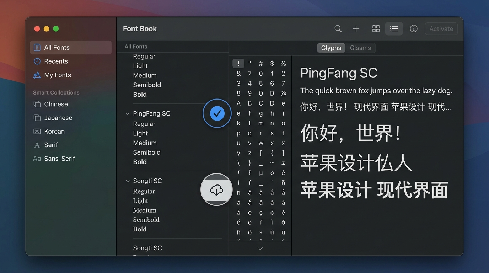

# 彻底解决！Chrome 打印/另存为 PDF 时中文字体不显示与乱码问题排查指南

在日常工作和学习中，我们经常需要将网页保存为 PDF 文件方便归档或分享。然而，不少 Mac 及 Windows 用户在使用 Google Chrome 浏览器进行 **“打印 -> 另存为 PDF”** 时，经常会遇到一个让人头疼的问题：

> **导出的 PDF 文件中，原本正常的中文内容变成了空白、方框（□）、问号或者乱码！** 甚至有时在 Chrome 打印预览窗口中看着一切正常，但保存出来用 macOS 自带的“预览”应用（Preview.app）打开时，文字却全不见了。

这个问题在 Apple 官方支持社区（[Apple Discussions Community](https://discussionschinese.apple.com/thread/255765808?sortBy=rank)）以及各类开发者论坛上引发了大量讨论。

本文将深入分析该问题背后的技术成因，并提供 **5 种从根源到快速应急的解决方案**，帮你彻底摆脱 Chrome PDF 打印乱码的困扰。

---

## 💡 一、为什么网页显示正常，导出 PDF 却缺失中文字体？

要解决问题，首先需要理解为什么网页屏幕显示与 PDF 导出结果不一致：

1. **Chromium PDF 引擎的字体嵌入机制（Font Subsetting）**：  
   Chrome 在生成 PDF 时，使用的是内置的 Skia / PDFium 渲染引擎。它不会直接对网页进行截屏，而是需要提取字体文件并尝试将用到的字符嵌入（Embed）到 PDF 流中。如果系统缺失对应字体的物理文件或字形映射失败，引擎就会回退（Fallback）到空字符或缺字方块。
2. **macOS 字体册（Font Book）的动态激活与云端下载机制**：  
   在 macOS 系统中，部分中文字体（如 `PingFang SC` 苹方、`Songti SC` 宋体、`Kaiti SC` 楷体等）的部分字重或字体族默认可能处于“未下载”或“未激活”状态。屏幕渲染时系统可以通过 CoreText 自动做替代渲染，但 Chrome 的 PDFium 引擎无法直接读取未激活的字体文件。
3. **网页 CSS 的 `font-family` 声明不规范**：  
   部分网站使用了自定义 WebFont 或仅仅指定了非标准的中文字体名称，没有在 CSS 中配置回退字体链（Fallback chain），导致 Chrome 打印引擎无法映射到本地的标准中文字库。
4. **macOS “预览”应用与 Adobe Reader 的编码解析差异**：  
   Chrome 生成的部分 CID 编码 PDF 在没有完整嵌入字形时，macOS 自带的“预览”应用解析极易出现字形丢失，而在 Chrome 内部或 Adobe Acrobat 打开可能表现不同。

---

## 🛠️ 二、5 大解决方案（按推荐程度排序）

### 方案 1：补全并激活 macOS 字体册中的中文字体（最根源修复）

大多数 Mac 用户出现此问题的根本原因，都是因为 macOS 系统的中文基础字体处于**未激活/未完全下载**状态。

#### 操作步骤：
1. 按下 `Cmd + 空格` 键打开 Spotlight 搜索，输入并打开 **字体册**（Font Book）。
2. 在左侧栏选择 **所有字体**（All Fonts），并在右上角搜索框中依次搜索常用的中文字体：
   - `PingFang SC` / `苹方-简`
   - `Songti SC` / `宋体-简`
   - `Heiti SC` / `黑体-简`
   - `Kaiti SC` / `楷体-简`
3. 检查搜索结果：如果字体名称显示为灰色，或者旁边带有“未下载/禁用”的提示，说明该字体未就绪。
4. **右键点击该字体**，选择 **下载**（Download）或 **激活**（Enable）。
5. **非常重要的一步**：修改完成后，按下 `Cmd + Q` 彻底退出 Chrome 浏览器并重新打开。



> **效果**：激活系统基础中文字体后，Chrome 即可正常提取本地字形嵌入 PDF，彻底解决空白和方框问题。

---

### 方案 2：使用 macOS 系统打印对话框替代 Chrome 原生打印（一秒绕过 Bug）

如果你当前急需导出文件，没有时间排查字体，这是最快、最有效的应急方案。它可以跳过 Chrome 内置的 PDF 引擎，直接调用 macOS 原生系统级 CoreText 打印引擎。

#### 操作步骤：
1. 在 Chrome 中按下 `Cmd + P` 打开打印界面。
2. 滚动到左侧面板底部，展开 **更多设置**（More settings）。
3. 点击 **使用系统对话框打印...**（Print using system dialog...），或者直接按下快捷键：  
   👉 `Cmd + Option + P`
4. 在弹出的 macOS 系统原生打印对话框中，点击左下角的 **PDF** 下拉菜单。
5. 选择 **存储为 PDF**（Save as PDF）。

```text
+-------------------------------------------------------------+
| Chrome 打印面板 (Cmd+P)                                      |
|  └── 展开 "更多设置" (More settings)                         |
|       └── 点击 "使用系统对话框打印" (Cmd + Option + P)         |
+-------------------------------------------------------------+
                               │
                               ▼
+-------------------------------------------------------------+
| macOS 系统原生打印对话框                                      |
|  └── 左下角按钮: [ PDF ▾ ]                                  |
|       └── 选择: "存储为 PDF" (Save as PDF)                   |
+-------------------------------------------------------------+
```

> **原理**：macOS 原生系统打印对话框使用的是苹果官方的 CoreText / Quartz PDF 引擎，对 macOS 字体库的兼容性接近 100%，生成的 PDF 绝不会出现中文缺失。

---

### 方案 3：修改 Chrome 默认“自定义字体”配置

如果 Chrome 浏览器的默认中文字体映射紊乱，也可以通过手动修改 Chrome 的字体设置来解决。

#### 操作步骤：
1. 在 Chrome 地址栏输入并打开：`chrome://settings/fonts`
2. 检查以下各项字体设置：
   - **标准字体 (Standard font)**：设置为 `PingFang SC`（苹方-简）或 `Microsoft YaHei`（微软雅黑）。
   - **无衬线字体 (Sans-serif font)**：设置为 `PingFang SC`。
   - **衬线字体 (Serif font)**：设置为 `Songti SC`（宋体-简）。
3. 调整完毕后，刷新目标网页，重新尝试 `Cmd + P` 另存为 PDF。

---

### 方案 4：开发者/高级用户技巧：开发者工具注入 CSS 字体覆盖

如果你遇到的问题是因为特定网页的 CSS 样式指定了异常字体导致打印失败，可以通过 Chrome 开发者工具临时注入通用字体。

#### 操作步骤：
1. 在网页上按下 `F12` 或 `Cmd + Option + I` 打开 **开发者工具**（DevTools）。
2. 切换到 **Console**（控制台）标签页。
3. 复制并粘贴以下代码并回车执行：

```javascript
const style = document.createElement('style');
style.innerHTML = `
  @media print {
    * {
      font-family: -apple-system, BlinkMacSystemFont, "PingFang SC", "Hiragino Sans GB", "Microsoft YaHei", sans-serif !important;
    }
  }
`;
document.head.appendChild(style);
```

4. 再次按下 `Cmd + P` 进行 PDF 导出，网页在打印时会被强制使用本地已安装的标准中文字体。

---

### 方案 5：借助 Safari 导出或“阅读模式”插件

如果上述方法仍不满意，还可以尝试切换渲染管道：

1. **使用 Safari 导出**：复制网页 URL，在 macOS Safari 浏览器中打开，点击菜单栏 **文件 -> 导出为 PDF...**。Safari 与 macOS 系统集成度最高，处理中文 PDF 从不踩坑。
2. **使用“阅读模式”/ PrintFriendly 插件**：安装 PrintFriendly 等浏览器扩展，先把网页转换为纯净排版后再导出 PDF，可以有效过滤复杂的网页 WebFont 干扰。

---

## 📝 三、总结与避坑建议

| 场景 | 推荐解决方案 | 优点 |
| :--- | :--- | :--- |
| **彻底根治** | **方案 1：在 macOS 字体册中激活/补全中文字体** | 解决所有 Chromium 架构软件（Chrome, Edge, VS Code）的打印字体问题 |
| **最快应急** | **方案 2：使用快捷键 `Cmd + Option + P` 调用系统 PDF 打印** | 无需配置，1 秒绕过 Chrome PDF 引擎 Bug |
| **网页开发者排查** | **方案 4：注入 CSS 强制标准中文字体回退** | 适合排查自定义 WebFont 导致的缺字问题 |

**终极避坑建议**：在 Mac 上遇到 Chrome 导出 PDF 缺字时，**不要盲目重装浏览器或清理缓存**。90% 的情况下，直接按下 `Cmd + Option + P` 调用系统打印对话框，或者去“字体册”补全下载 `PingFang SC` 就能完美解决！

---

> **参考链接**：
> - [Apple 官方支持社区讨论：Chrome 另存为 PDF 中文字体丢失问题](https://discussionschinese.apple.com/thread/255765808?sortBy=rank)
> - [Chromium Issue Tracker: Skia PDF font embedding fallback](https://bugs.chromium.org/p/chromium/issues/list)
